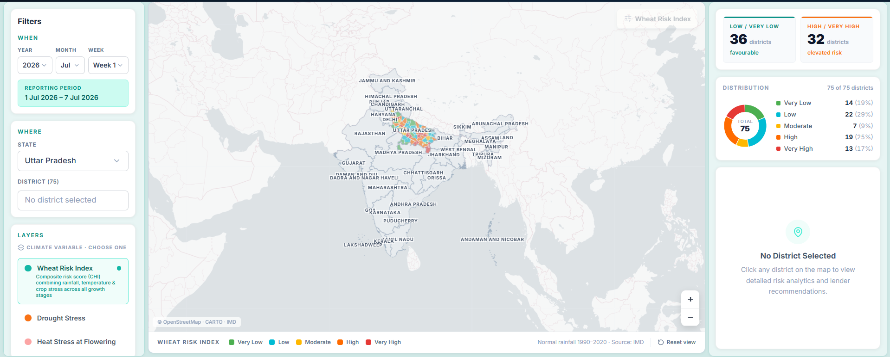
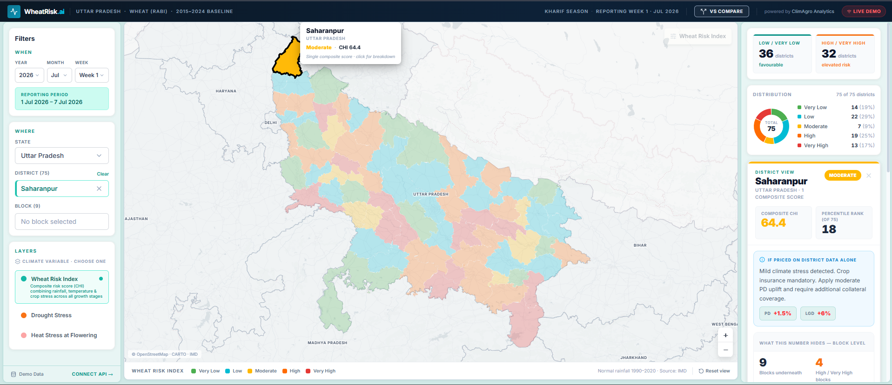
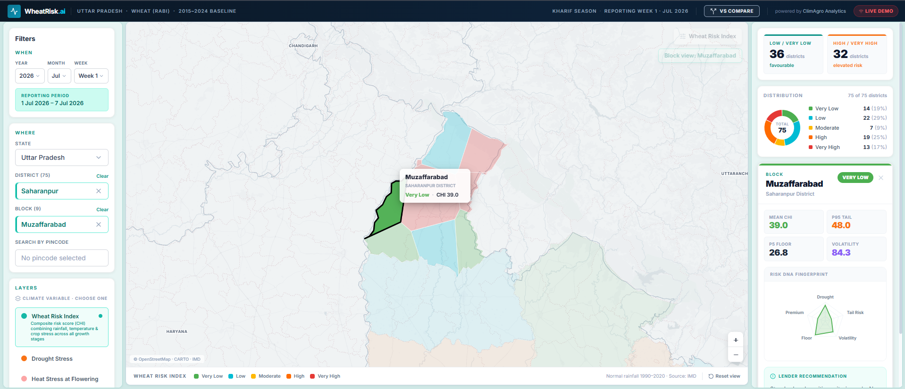
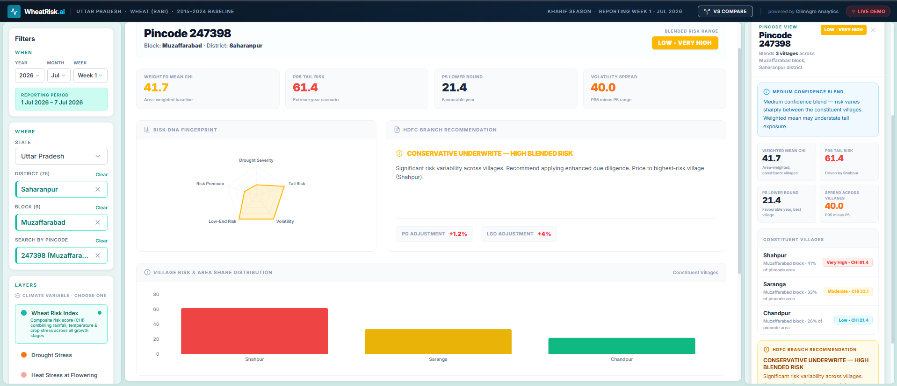
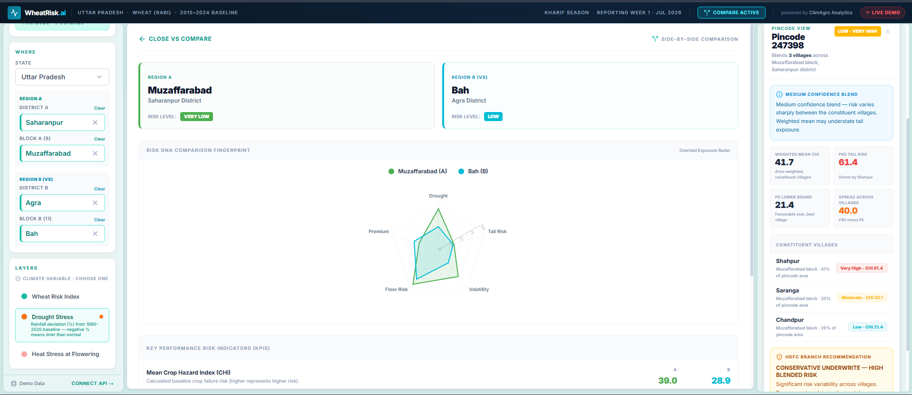

# WheatRisk.ai — Agricultural Underwriting & Climate Intelligence Dashboard

WheatRisk.ai is a state-of-the-art agricultural underwriting and crop loan risk-management system. It aggregates localized weather anomalies, soil conditions, and historic climate trends to project wheat crop failure hazards across Uttar Pradesh (UP), India. Designed for financial institutions (like HDFC Bank) and agricultural lenders, the platform maps portfolio exposure limits directly to granular district, block, and pincode hazard levels.

---

## 🚀 Key Features

### 🗺️ Interactive Crop Hazard Index (CHI) Map
- Color-coded geographic visualization of UP's 75 districts.
- Toggle between layers: **Wheat Risk Index**, **Drought Stress**, and **Heat Stress at Flowering**.
- Dynamic zoom scaling: Selecting a district automatically maps its constituent blocks with bold boundaries.

### 🆚 Side-By-Side comparison (VS Mode)
- Compare two regions (Region A vs. Region B) side-by-side.
- Overlays **Risk DNA Fingerprints** on a single radar chart to compare vulnerabilities (Drought, Tail Risk, Volatility, Floor Risk, Premium).
- Compares risk indicators, underwriting recommendations, and PD/LGD adjustments.

### 📈 10-Year Historical Climate Trend
- Reviews a 10-year time-series (2016-2026) chart of temperature anomalies and rainfall deviations for any selected pincode.
- Displays metrics like **Worst Drought Year** and **Peak Heat Spikes** to identify historical vulnerabilities.

### 💼 Portfolio Exposure & Concentration Limits
- Monitors a active **₹500 Crore crop loan book** distributed across risk zones.
- Displays active outstanding totals and triggers alerts when exposure in high-risk zones nears threshold limits (e.g. ₹100 Crore limit).

---

## 📸 Screenshots & Interface Previews

### 🗺️ 1. Interactive Crop Hazard Index (CHI) Map (Wheat Risk Index)
Comprehensive state-wide visualization mapping agricultural risk indicators across 75 districts.


### 📊 2. District-Level Risk Analysis & Lender Recommendations
Granular metrics dashboard for the selected district, featuring composite score calculations and pricing uplifts.


### 🧬 3. Block-Level Detailed Risk Profile (with Risk DNA Radar)
Sub-district analysis showcasing vulnerability profiles, tail risks, volatility indices, and localized recommendations.


### 🏡 4. Pincode-Level Risk Analysis & Village Distribution
Constituent village risk shares and area distributions mapping extreme tail risks vs floor bounds.


### 🆚 5. Side-by-Side Regional Comparison (VS Mode)
Dual-region analytics comparison with overlaid exposure radar fingerprints and comparative KPI metrics.


---

## 🛠️ Technical Stack

- **Frontend**: React (Vite), TypeScript, Tailwind CSS, Leaflet Maps, and Recharts (radar, composed time-series, and stacked horizontal progress bars).
- **Backend**: Node.js & Express.js API server (serves boundaries, layers, and district aggregates).
- **Package Manager**: pnpm workspaces (monorepo).

---

## 💻 Local Development

### 1. Prerequisites
Ensure you have [Node.js (v18+)](https://nodejs.org/) and [pnpm](https://pnpm.io/) installed.

### 2. Install Dependencies
Run the following command at the root of the project to install all workspace dependencies:
```bash
pnpm install
```

### 3. Run the Development Servers
Start both the Express backend API server and the Vite React frontend server concurrently:
```bash
# In the root directory:
pnpm run dev
```
Open **[http://localhost:3000](http://localhost:3000)** in your browser.

---

## 🐳 Docker Production Build (Single Container)

A production-ready [Dockerfile](Dockerfile) is provided at the root of the project to run both the frontend and backend under a single port (`5000`):

```bash
# Build the Docker image
docker build -t wheatrisk .

# Run the container
docker run -p 5000:5000 -e PORT=5000 wheatrisk
```
Access the production build at **http://localhost:5000**.

---

## 🌐 Deploying to Vercel (Frontend)

To deploy the React interface to Vercel:
1. Push your repository to GitHub.
2. Sign in to [Vercel](https://vercel.com/) and click **"Add New Project"**.
3. Set the **Root Directory** to `artifacts/wheatrisk` (the React frontend folder).
4. Set the **Build Command** to `npm run build` or `pnpm run build` and **Output Directory** to `dist`.
5. Add the environment variable:
   - `VITE_API_BASE_URL` = (the URL pointing to your backend API server on Render/Railway)
6. Click **"Deploy"**.
